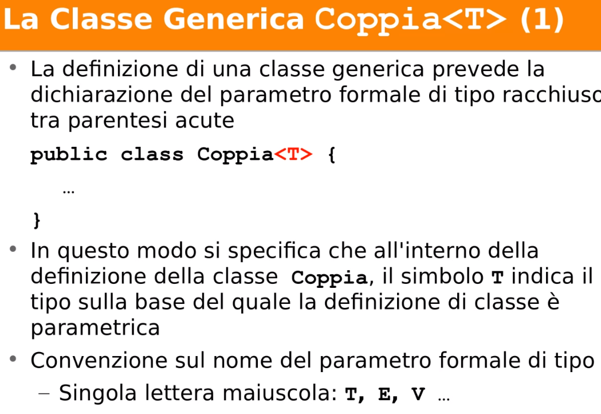
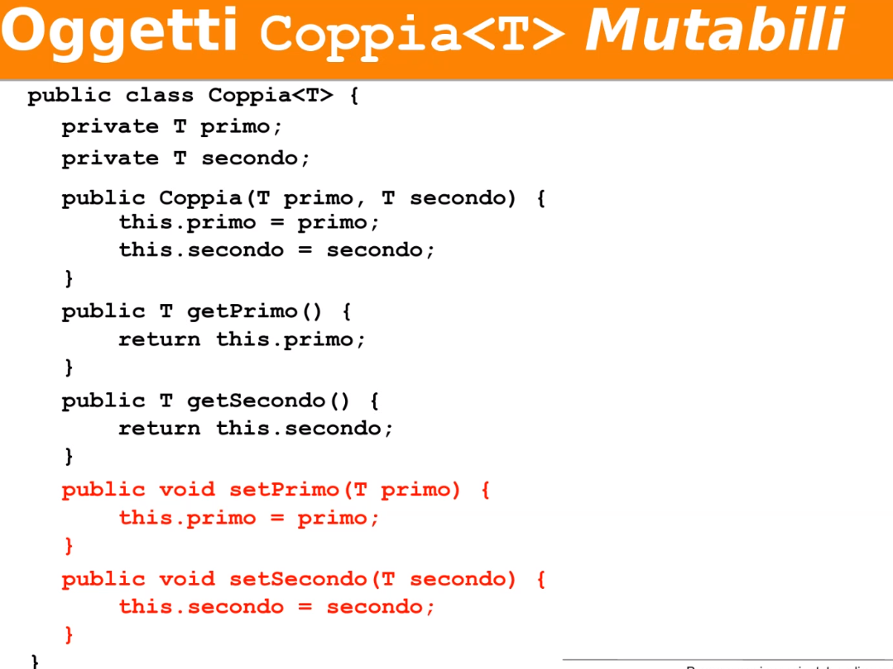

# Appunti lezione giovedì 22 aprile

Generics per studiare il java collection framework.

Un concetto un po' più avanzato

#### Cosa sono i Generics?

 

 Il nostro obbiettivo è di usare classi generiche e non crearle. Ma la cosa migliore per capirle è proggettare classi genereriche rudimentali: che noi chiameremo _Coppia_.

 

 

  Creiamo una classe coppia utilizzando il polimorfismo. Noi la creiamo utilizzando la classe Object perché ancora non abbiamo fatto i generics.

  

  
  Questo codice compila perché si fa una downcasting da Object a persona. L'analisi statica regge. Faccio get e mi da una classe Object e poi faccio un downcasting alla classe persona.

  __Funziona anche?__

  Si funziona perché in persona c'è un oggetto che a tempo dinamico e un oggetto persona.

  ### Proviamo questo caso

non compila perché il tipo è una coppia di persone e non di generici oggetti.

il proiblema è che la nostra tipizzazzione è stata troppo lasca.

Prima die Generics si facevano scasting che funzionavano la erano brutti.

Generics introdotti in java 5 per tipizzazzione più stretta.

Con in Generics si pùo cominciare a distinguere diversi tipi

Tipo formale scritto con una sola lettera maiuscola

per definire il tipo formale "T" bisogna saper cos'è il tipo "T".

>Generics valutato a tempo statico

LA differenza tra paramerto formale e attuale e Generics

Collezioni la E si riserva per elemento della collezione.

Per avere classi mutabili metto anche dei set().

è il compilatore che decide di quale tipo deve essere T.

Persona è il tipo attuale T tipo formale di coppia.

Il compilatore ha dovuto quela tipo scegliere per ogni tipo generico.

Non molto frequennte tranne che per le mappe.

__è errato dire Coppia<Persona>=new Coppia<Studente>(); con Studente sottotipo di Persona?__

Si dovrebbe compilare,

I generics non si prestano a istanziare come parametro formale un tipo primitivo. Questo è uno dei motivo perché si introduce il meccanisco di boxing/unboxing.

Per ovviare a ciò cengono introdotte le classi wrapped.

__Come faccia a fare unwrapp?__

Questi wrapping e unwrapping il compilatore lo fa da sol0 per noi.

Diventato possiblile da java 5 in poi.

poter chimare con modi diversi la stessa cosa fa male soprattutto ai programmatori non esperti.

#### Convensione tipo generico

Andiamo avanti per vedere proprietà delle classi generiche.

La semantica del metodo _copyAll()_ copia i parametri del parametro formale nell'oggetto sul quale viene chiamato il metodo.

questo metodo riceve un'altra coppia.

