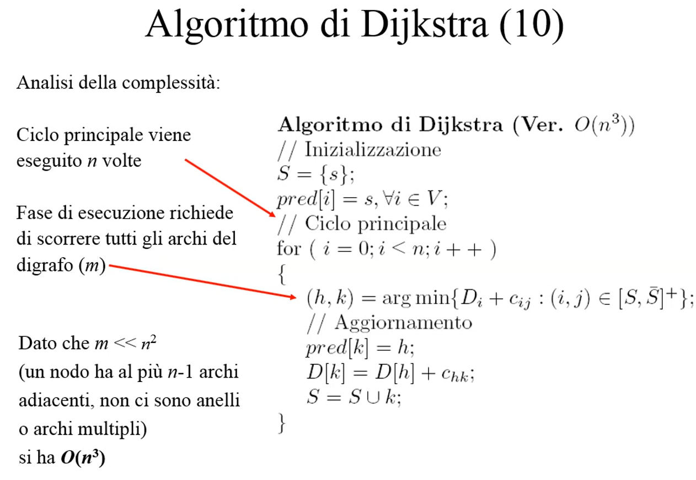
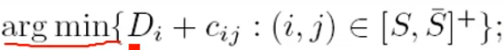
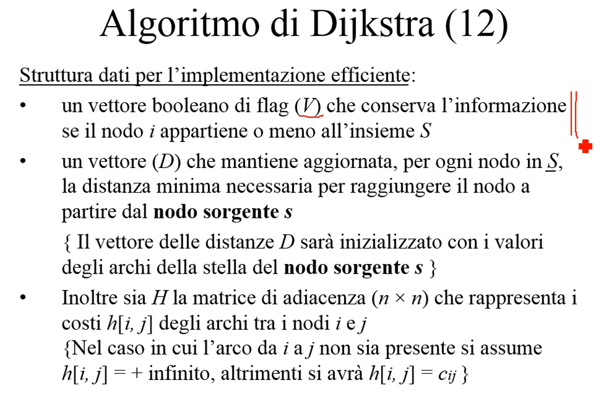
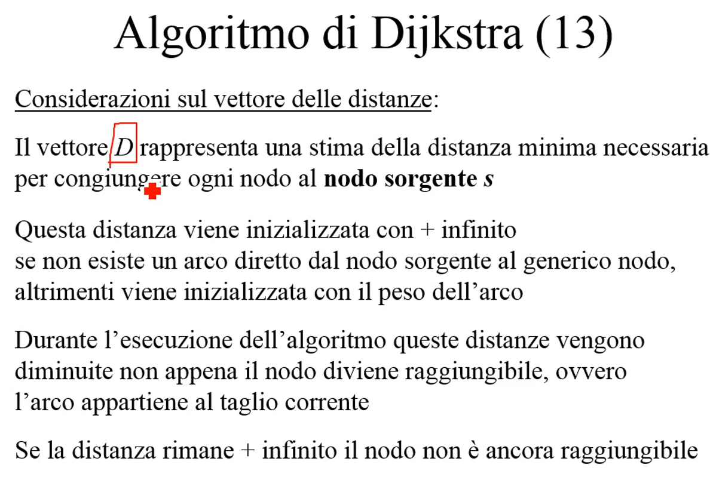
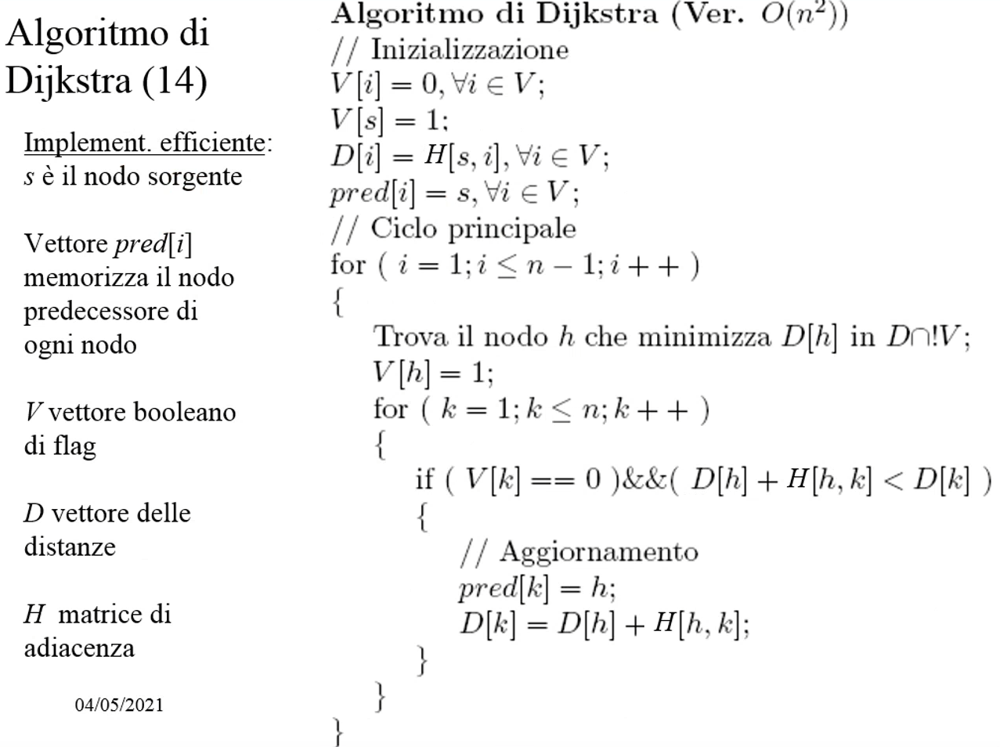
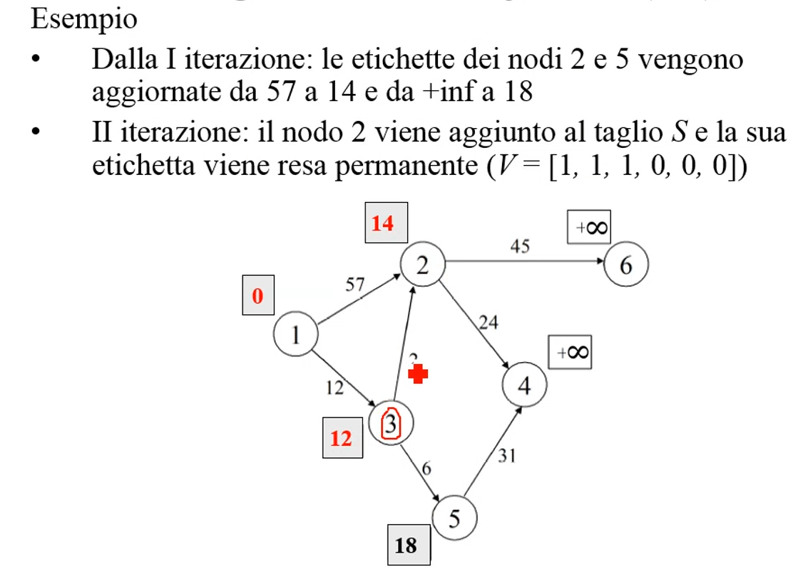
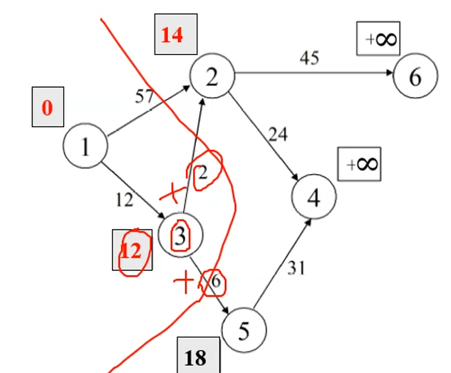
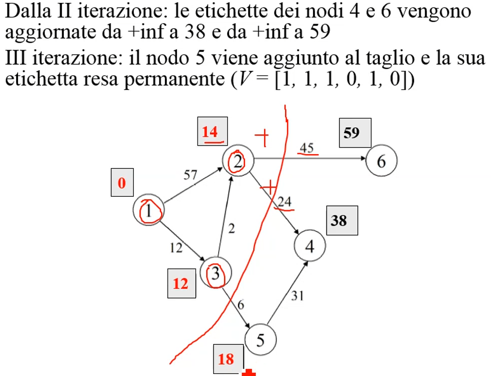

# **Appunti Ricerca Operativa lezione martedì 4 maggio**

### Riprendiamo con il problema dello shortest path
Consiste nel trovare un cammino minimo in un di grafo partendo da un nodo sorgente

Algoritmo di Dijkstra con complessità n^3 

Dijkstra risolve problemi in cui il peso dei lati è maggiore uguale a zero.

Cerchiamo un versione di questo algoritmo meno costosa. la fase di inizializzazioen non impatta sulla complessità. Ogni volta che entro in un ciclo for devo far entrare un nuovo nodo e lo scelgo cercando l'arco che minimizza il taglio. Nel caso peggiore devo guardare tutti gli _m_ archi del grafo.

Questa è la formula per trovare l'arco di costo minimo  

guardo tutti gli archi che partono da un Nodo in S e vanno in S segnato e devo guardare la distanza + il peso del nodo.

Se prendo un nodo (i,j) con _i_ in S e _j_ in S segnato calcolo tutte le somme e scelgo la minore.

__E' veramente necessario guardare tutti tutti gli arche per scegliere quelli ottimi?__

si possono memorizzare le informazioni sul taglio corrente e aggiornare il taglio a quello corrente e prendere le informazioni di prima e riusarle all'iterazione successiva.

__Dobbiamo trovare una nuova struttura dati__

V -> flag che identifica se un nodo appartiene o no ad S

H -> matrice di adiacenza 

all'esame uso direttamente in grafo senza usare la matrice di adiacenza.

H ad ogni elemento corrisponde il peso di un arco se eseste altrimenti +infinito.

D -> memorirra la distanza tra in nodo sorgente e quello corrente.

in più ci serve il vettore dei predecessori non indicato nelle slide.

Si ha un'assegnazione corretta della distanza deòl nodo solamente quando entra in S. Inizialmente ogni elemento avrà una distanza infinita

Prima di risolvere il problema ho bisogno che mi sia dato il nodo sorgente. 

>Se cambio il nodo sorgente la soluzione ottima cambia.

#### Esempio illustrativo che non appilichiamo all'esame 

Mi viene dato come nodo sorgente il nodo 1, guardo la stella degli archi uscenti e noti che ha distanza 57 dal 2, 12 dal 3 e infinito dagli altri nodo perchè non c'è un arco diretto che li collega.

faccio il primo taglio e vedo che l'arco che minimizza il taglio è il 12

Aggiorno guardando il nodo 3 ciò che sta in S segnato

Effettuo il nuovo taglio e vedo che l'arco che minimizza il taglio e quello che collega 3 e 2.

riaggiorno la stella degli archi uscenti

Effettuo un altro taglio e continua a trovare l'arco che lo minimizza ed aggiornare S segnato fino a quando non avrò inserito n-1 archi. 

minuto 20  

