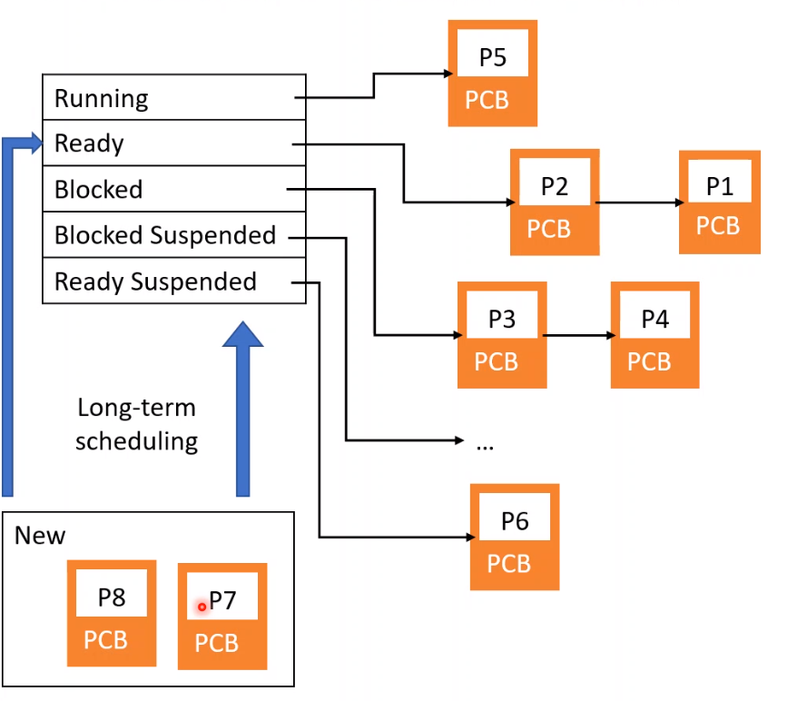
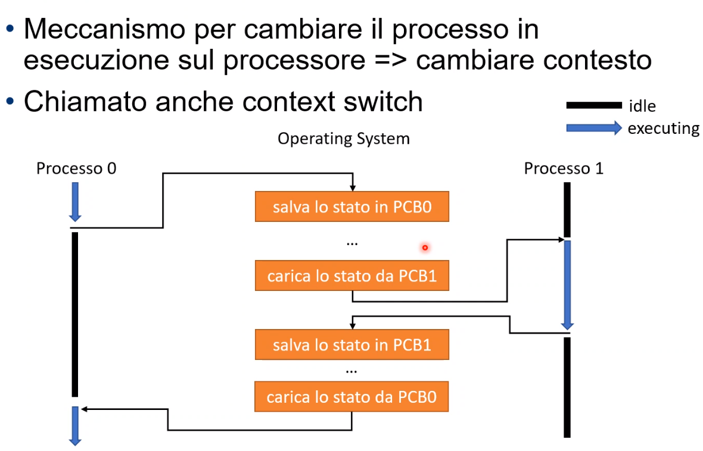

# Lezione mercoledì 6 ottobre - Sistemi operativi

Lo stato di un processo ci permette di capire cosa sta facendo quel processo

In modo incrementale abbiamo realizzato una macchiana a stati.

Un processo non in esecuzione sarà in uno stato ready to run e la transizione che ci permette di passare sallo stato ready to run e running è il dispatch

Associamo una coda allo stato ready to run ma questo ha un problema cioè che nel momento un cui il processore deve andare a scegliere un processo deve andare a guardarsi la coda ma se nel processo non c'è scritto se il processo è bloccato o meno non va bene.

Andremo ad agguingere lo stato blocked

In questo schema manca una transizione altrimenti i processo bloccati rimarrebbero sempre bloccati. la transizione collega il blocked al ready to run qunado l'evento si verifica.

Adesso quando il processore deve andare a scegliere un processo può sceglierlo dalla coda ready to run senza preoccuparsi di nulla(trovare un processo ready to run).

Un'altra cosa che possiamo fare  è definire più code blocked per diversi tipi di evento ma questo non basta perché ci sono diversi tipi di inefficienze.

MEttiamoci nella condizione che non ci siano processi ready  to run ma sono processi blocked. Cosa si può fare? per ora nulla, sprechiamo solo colpi di clock.

Una soluzione per alleviare questo problematica è aumentare le probabilità che la coda ready to run non sia mai vuota. Per fare questo aumento la cardinalità dei processi che riesco a gestire, aumentare il livello di multiprogrammazione.

Il problema della momoria si può risolvere semplicemente aumentando la memoria. MA questo approccio ritarda il problema e la RAM costa. Un dispositivo che costa meno sono gli HDD che potremo utilizzare inserendo i processi nell ostato blocked nell'HDD.

Definimo adesso due operazioni
- Swap in
- Swap out

nella macchiina a stati a questo punto serve un'altro stato che chiameremo suspended con un'altra transizione che chiameremo swap in. Dove arriviamo dipende.

Questa macchian non è rappresentativa, cosa posso fare per migliorarla?

Possiamo imporere che il processo da suspended passi a ready inseriamo un'altro ostato

In quyesto scenario possiamo imporre che prima dello swap in ci sia l'evento.

LA transizione arancione è veramente inutile. No perché potrebbero esseci delle condizioni prediciili per cui mi porto avanti con in lavoro portando dei processi in RAM.

Una swap out dalla ready to run alla suspended è sensata? Mettiamo il caso che abbiamo un processo memory hungry, che ha bisogno di molta ram, allora butto fuori dalla ram altri processo i faccio runnare questo processo.

In qusta macchina a stati c'è un enorma bug. Come faccio ad entrare in questa macchina a stati?

Creo uno stato new che può fare swap in in ready to run o in ready suspended.

Adesso manca uan stato per dier ceh il processo ha terminato in modo non problematico la sua usecuzione, oppure che termina per causa di un errore.

in una tipoca macchina a stati poi ci sono anche degli entry point.

Come fa il sistema operativo a tenere traccia si tutti i processi? Ad esempio al ssitema operativo serve una struttora dati che senrve per tenere traccia di tutti i processi, ad esempio uan tabella(tabella normale oppure un'hash table)

RAgionevolmete servono anche tabelle che servono per gestire la memeria e le altre diverse risorse. Ad esempio una tabelel che ci permette di tenere traccia di della memoria deidcata ad un processo e quanta memoria gli è stata dedicata

Adesso andiamo ad aggiungere le strutture dati citate prima cioè le

----
Mettiamo il caso che il processo P5 deve essere tolto dallo stato running e i candidati per l'inserimento il running sono il P1 e P2

__Medium-term scheduling__

Altra possibilità in cui passiamo da una stato ready suspended a ready e da blocked suspended a blocked.

__Short-term scheduling__

In cui passiamo da ready a running.
Se dimmiamo fare ciò il processo P5 dove va a finire? LA risposta è che va alla stato ready to run.

###### Process switch
DA un lato abbiamo un processo zero che sta eseguendo, dall'altro abbiamo il processo 1 che è ready. Salva le informazione di P0 per rischedularlo nel PCB, carica lo stato del PCB1 e lo mette running e così per altri eventuali porcessi

